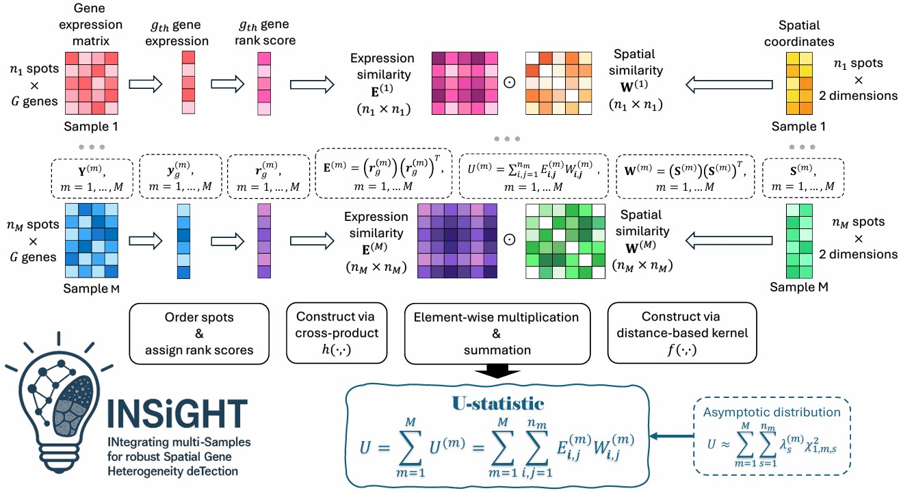

# INSiGHT
INSiGHT (INtegrating multi-Samples for robust Spatial Gene Heterogeneity deTection) is a non-parametric statistical framework designed to robustly analyze spatial variability across multiple tissue slices.

For each gene, INSiGHT ranks expression levels within samples, combines the rank scores, and constructs a gene expression similarity matrix, which is compared with a spatial similarity matrix derived from distance-based kernels. A rank-based $U$-statistic is then used to test the association between expression and spatial similarity, with inference based on its asymptotic distribution. Because it relies only on relative spatial distances, INSiGHT is rotation-invariant and ensures consistent results

## Installation
Please run the following codes in R to install STANCE package from GitHub.
```
if (!require("devtools", quietly = TRUE)){
  install.packages("devtools")
}
devtools::install_github("HaroldSu/INSiGHT")
```
